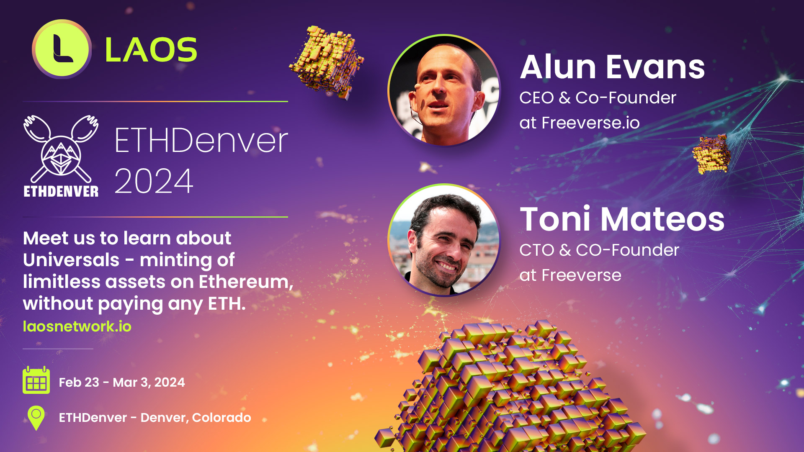

# BUIDL at ETHDenver with [**LAOS Network**](https://laosnetwork.io) 

## Mint assets on Ethereum, without paying ETH

LAOS is a Layer 1 that connects without bridges to Ethereum, Polygon, their respective L2s, and any other EVM-compatible chains. It allows for the minting of large number of assets on these chains without incurring native gas fees, eliminating the need for bridges or wrapped currency, while still being fully compatible with their DApps and marketplaces.

## Why should I BUIDL with LAOS?

You can build applications on Ethereum or Polygon which require truly massive minting: mints won't require using ETH/MATIC, and you won't collapse those networks.

## No ETH for minting in Ethereum? That sounds like magic and/or a scam. How does it work? Does it use bridges?

LAOS is a parachain in the Polkadot/Kusama ecosystem, and is secured by Polkadot’s well-regarded and battle-tested security.

We use a pattern we refer to as Bridgeless Minting / Bridgeless Connectivity, which leverages Polkadot’s ‘Universal Location’ (from the XCMv3), originally developed to allow communication across its Parachains. 

LAOS' extension of this pattern links an ERC721 contract deployed on Ethereum with a sibling collection deployed in LAOS. Universal Location fills the link between both consensus systems, allowing minting and evolution to be performed in LAOS, while trading and anything related to ownership remains on Ethereum, compatible with all its ecosystem. 

No bridges are required.

## I don’t believe you. Show me the proof.

Here are the Opensea links to the [Ethereum](https://opensea.io/collection/eth-laos-bridgeless-minting) and [Polygon](https://opensea.io/collection/universal-polygon-collection) public collections of assets minted via LAOS' bridgeless pattern. No ETH or MATIC were used to mint these assets.

## What else can I do in LAOS?

LAOS can also be used **the reverse way**. With Bridgeless Minting (described above), other consensus systems point to LAOS. **The reverse way** is about using LAOS to point to other consensus systems. For example, one of LAOS' protocol-level features is called Decentralized Asset Metadata Extender (DAME). It allows anyone, permissionlessly, to extend the metadata associated with any NFT, in any chain, irrespective of who created it, or who owns it.

Check this simple [on-boarding site for DAME](https://apps.klaos.io/extend) for more info, and to try your first asset extensions.

## Q&A

* **Is LAOS EVM-compatible?**  Yes. 100%. You can deploy your smart contracts, use your standard web3 libraries, wallets, etc. [Here](https://app.gitbook.com/o/Che3PkDSFGGaCerv2hS8/s/HUKiUao8hGUgferucKd9/introduction/laos-and-k-laos) are some public endpoints and the rest of EVM data.

* **Is this similar to Inscriptions?** Not really. Bridgeless Minting uses two consensus systems, and does not require using TX's calldata. Check [this post](https://medium.com/laosnetwork/introducing-universals-assets-minted-via-bridgeless-patterns-in-any-blockchain-6265e2313e5a) to dig further.  

## Any ideas for a building DApps on LAOS Network?

* **LAOS for Bitcoin Ordinals/Inscriptions**. LAOS is already serving EVM chains like Ethereum, Polygon, etc. to offload their minting pressure. Similar patterns can be implemented for scaling Bitcoin Inscriptions, using LAOS as its sibling consensus system.

* **LAOS' DAME for Veracity Claims**. In the paradigm we are entering, where everything can be fake, use DAME to allow anyone to permissionlessly associate  metadata to any IPFS address. For instance, consider a photographer who uploads photos documenting a conflict to IPFS. The BBC and any other interested party can verify the authenticity of these photos. Similarly, the credibility of the verifiers, such as the BBC, influences whether viewers trust the validity of the photos, depending on the level of reputation the viewers attribute to the claimers.

## How can I try this out as a user?

This is a user facing basic [on-boarding front-end](https://apps.klaos.io/). Within it, you'll find the:

- [Faucet](https://apps.klaos.io/faucet): Grab some test tokens from the Faucet;

- [Bridgeless Minter App](https://apps.klaos.io/): No-code minting of assets on Ethereum and Polygon, without paying ETH or MATIC;

- [Asset Metadata Extension](https://apps.klaos.io/extend): Permissionlesly extend the metadata of any asset.

## How can I develop on LAOS?

LAOS is fully decentralized, permissionless and open-source. The following references may help you build your DApps:

- [Documentation](https://docs.laosnetwork.io/): Full documentation, more geared towards experienced blockchain developers.

- [Examples page](https://github.com/freeverseio/laos-examples): This repot is the best place to try bridgeless minting on LAOS using standard web3 libraries, with a full set of examples in Node.JS.

- [LAOS Github](https://github.com/freeverseio/laos): The main repository for the protocol, the node, instructions on how to run it, and public RPC endpoints.

## For more information

- [All resources in one place](https://docs.laosnetwork.io/introduction/resources), including white and litepapers, videos, walkthroughs and demos.

- [The LAOS Network Homepage](https://laosnetwork.io/)

- [Discord](https://discord.gg/gZcxsJcdPy): Join our Discord server to ask questions and participate.

- [Twitter/X](https://twitter.com/laosnetwork): Follow us on Twitter to keep up to date.

# Disclaimer

LAOS is targeting late early Q2'2024 to bid for a Parachain slot on Polkadot. 
Presently, LAOS is accessible via its canary Parachain in Kusama, named K-LAOS, which stands for Kusama LAOS.
Please read the [disclaimer about K-LAOS](https://www.laosfoundation.io/disclaimer-klaos) that stresses the fact
that K-LAOS is used purely as a testing network.
